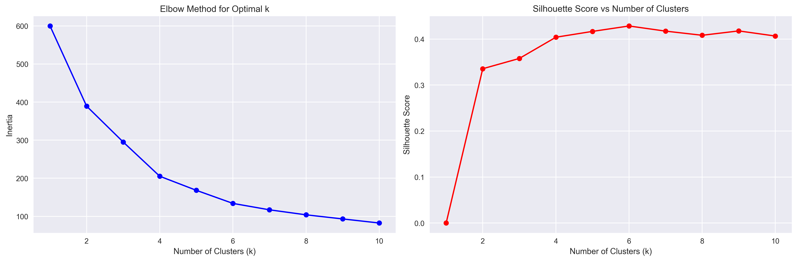
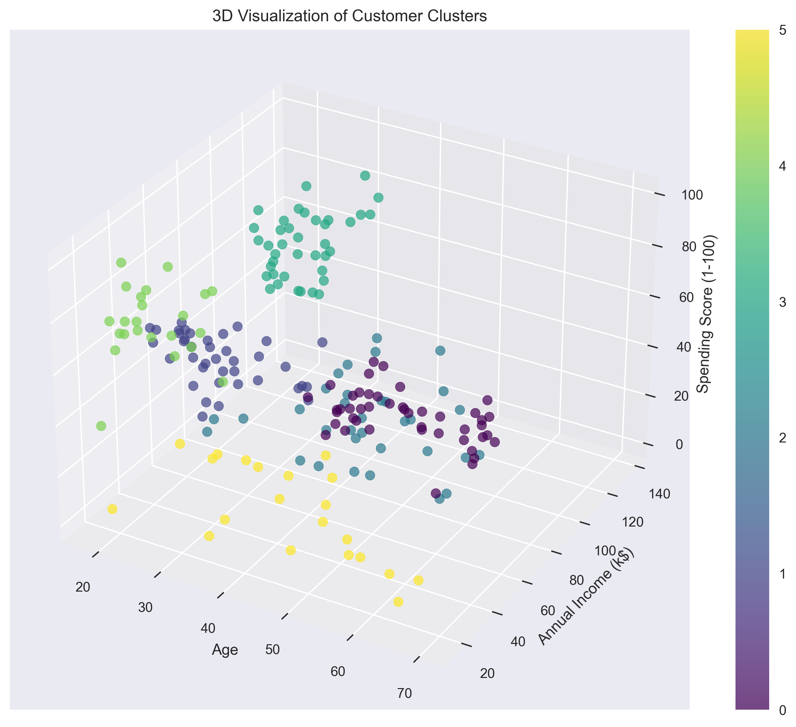

# Mall Customer Segmentation using K-Means Clustering

## Project Overview

This project performs unsupervised learning using K-Means clustering to segment mall customers based on their demographics and spending behavior. The analysis helps identify distinct customer groups that can be targeted with specific marketing strategies.

## Dataset

**File:** `Mall_Customers.csv`

**Features:**
- `CustomerID`: Unique identifier for each customer
- `Gender`: Customer's gender (Male/Female)
- `Age`: Customer's age
- `Annual Income (k$)`: Annual income in thousands of dollars
- `Spending Score (1-100)`: Score assigned based on customer behavior and spending nature

**Dataset Size:** 200 customers

## Methodology

### 1. Data Exploration and Preprocessing
- Loaded and examined the dataset structure
- Checked for missing values (none found)
- Encoded categorical variables (Gender)
- Selected numerical features for clustering: Age, Annual Income, and Spending Score

### 2. Optimal Cluster Selection
- Used the **Elbow Method** to identify the optimal number of clusters
- Calculated **Silhouette Scores** for different cluster numbers
- Applied **StandardScaler** for feature normalization

### 3. K-Means Clustering
- Performed clustering with the optimal number of clusters (6)
- Achieved a silhouette score of **0.428**

### 4. Visualization and Analysis
- Created multiple 2D scatter plots showing clusters across different feature pairs
- Generated a 3D visualization combining all three features
- Analyzed cluster characteristics and demographics

## Results

### Optimal Cluster Selection

The analysis used both the Elbow Method and Silhouette Score to determine the optimal number of clusters:



*Left plot shows the Elbow Method with inertia values, right plot shows Silhouette Scores for different cluster numbers*

### Optimal Clusters: 6

#### Cluster Characteristics:

**Cluster 0 - Middle-aged Moderate Spenders (22.5% of customers)**
- Average Age: 56.3 years
- Average Income: $54.3k
- Average Spending Score: 49.1
- Balanced gender distribution

**Cluster 1 - Young Average Earners (19.5% of customers)**
- Average Age: 26.8 years
- Average Income: $57.1k
- Average Spending Score: 48.1
- Slightly more females

**Cluster 2 - High Earners, Low Spenders (16.5% of customers)**
- Average Age: 41.9 years
- Average Income: $88.9k
- Average Spending Score: 17.0
- Conservative spenders with high income

**Cluster 3 - High Earners, High Spenders (19.5% of customers)**
- Average Age: 32.7 years
- Average Income: $86.5k
- Average Spending Score: 82.1
- Premium customers - high value targets

**Cluster 4 - Young High Spenders (11.5% of customers)**
- Average Age: 25.0 years
- Average Income: $25.3k
- Average Spending Score: 77.6
- Young customers who spend despite lower income

**Cluster 5 - Older Low Earners (10.5% of customers)**
- Average Age: 45.5 years
- Average Income: $26.3k
- Average Spending Score: 19.4
- Price-sensitive segment

### Cluster Visualizations

The following 2D scatter plots show how customers are distributed across different feature combinations:


*Multiple perspectives of the clustering results: Age vs Income, Income vs Spending Score, Age vs Spending Score, and Gender distribution across clusters*

The 3D visualization provides a comprehensive view of all three features simultaneously:



*3D visualization showing customer clusters across Age, Annual Income, and Spending Score dimensions*

## Business Insights

### Marketing Strategy Recommendations:

1. **Cluster 3 (High Earners, High Spenders)**: Target with premium products and luxury services
2. **Cluster 4 (Young High Spenders)**: Focus on trendy, affordable products with financing options
3. **Cluster 2 (High Earners, Low Spenders)**: Emphasize value and quality to convert conservative spenders
4. **Cluster 5 (Older Low Earners)**: Offer budget-friendly options and discounts
5. **Clusters 0 & 1**: Maintain engagement with balanced marketing approaches

### Key Applications:
- **Targeted Marketing Campaigns**: Customize marketing messages for each segment
- **Product Recommendations**: Tailor product suggestions based on cluster characteristics
- **Customer Retention**: Develop retention strategies specific to each customer type
- **Pricing Strategies**: Implement dynamic pricing based on customer segments

## Technologies Used

- **Python 3.x**
- **Pandas**: Data manipulation and analysis
- **NumPy**: Numerical computations
- **Scikit-learn**: K-Means clustering and preprocessing
- **Matplotlib**: Data visualization
- **Seaborn**: Enhanced statistical plotting

## Installation and Usage

1. **Install Dependencies:**
   ```bash
   pip install -r requirements.txt
   ```

2. **Run the Analysis:**
   ```bash
   python MAIN.py
   ```
   
   *Note: The script will automatically generate and save visualization plots as PNG files in the same directory.*

## Generated Visualizations

The analysis produces three key visualization outputs:

1. **`optimal_clusters_analysis.png`**: Shows the Elbow Method and Silhouette Score analysis used to determine the optimal number of clusters (k=6)

2. **`clustering_results_2d.png`**: A 2×2 grid of scatter plots showing:
   - Top-left: Age vs Annual Income with cluster colors
   - Top-right: Annual Income vs Spending Score with cluster colors
   - Bottom-left: Age vs Spending Score with cluster colors
   - Bottom-right: Cluster distribution by Gender (bar chart)

3. **`clustering_results_3d.png`**: Interactive 3D scatter plot showing all three features (Age, Income, Spending Score) simultaneously with cluster color coding

## Files Structure

```
TASK 8/
├── MAIN.py                          # Main clustering script
├── Mall_Customers.csv               # Dataset
├── requirements.txt                 # Python dependencies
├── README.md                        # Project documentation
├── optimal_clusters_analysis.png    # Optimal cluster selection plots
├── clustering_results_2d.png        # 2D clustering visualizations
└── clustering_results_3d.png        # 3D clustering visualization
```

## Key Features of the Implementation

- **Automated Optimal Cluster Selection**: Uses both elbow method and silhouette analysis
- **Comprehensive Visualization**: Multiple plotting perspectives including 3D visualization
- **Statistical Analysis**: Detailed cluster statistics and demographics
- **Business-Ready Insights**: Actionable recommendations for marketing strategies
- **Modular Code**: Well-structured functions for easy modification and extension

## Future Enhancements

- Implement DBSCAN or hierarchical clustering for comparison
- Add customer lifetime value prediction
- Include temporal analysis if historical data becomes available
- Develop automated reporting for business stakeholders

## Author

Created as part of AI/ML Internship - Task 8: Clustering with K-Means 